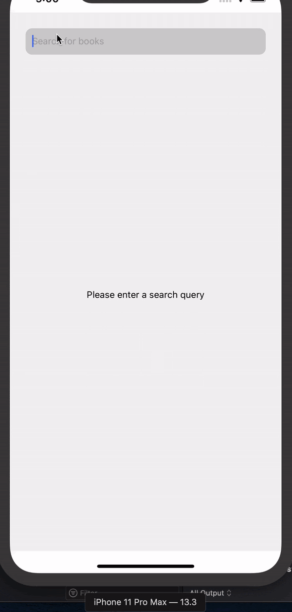
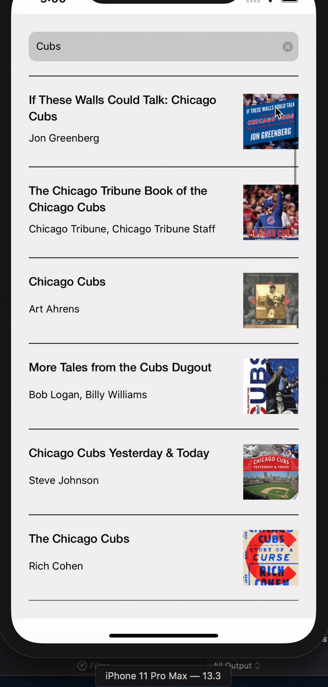

React Native Mobile application utilizing google books API to search books. Built for iOS. Utilizes react-navigation for navigating screens.

Current Functionality:

- An unauthorized user can search for a book using the google books api
- List can grab up to ten books, after that a user most scroll to the bottom 10% of the list(last book) and we will query for an additional 10 books
- loading and typing states are handled
- User can clear input box
- small/basic animation for rendering list

Todo/possible improvements:

- Favoriting
  - Optimal: Adding in authentication
    - would allow user to grab their own favorited books and also favorite books
  - add in redux
    - would allow a user to favorite a book (save that book in the store)
    - Could access later (most likely out of sync from google books so would require a refresh)
- refine loading and error/no results messaging

Setup:

- create a `.env` file that includes the `GOOGLE_BOOKS` variable for the google API key
- `npm install && pods install`
- run 'goodReads.xcworkspace' in xcode

